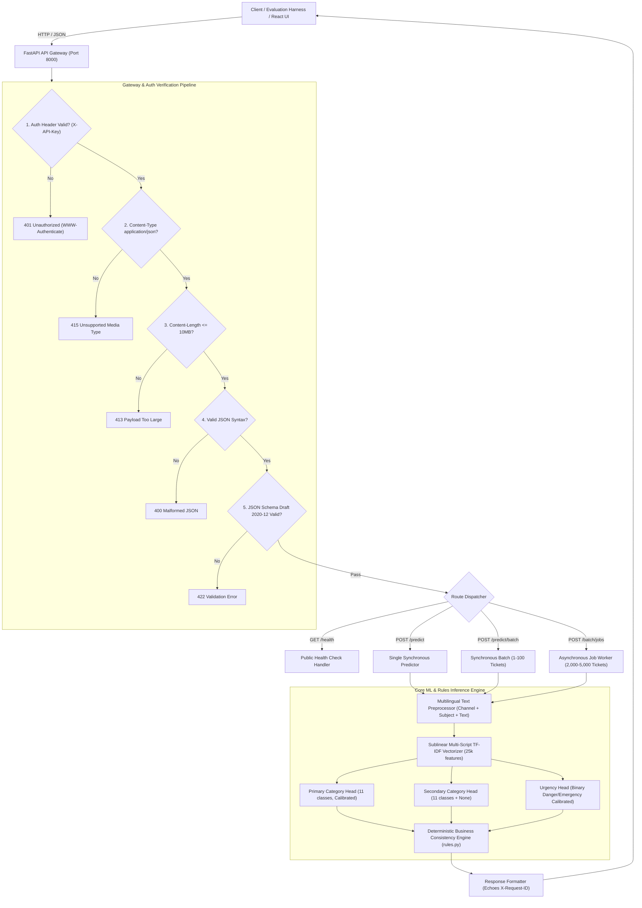

# TensorForge 2.0 — Customer Support Ticket Classification and Routing System

[](https://fastapi.tiangolo.com)
[](https://swagger.io/specification/)
[](https://json-schema.org/)
[](https://www.docker.com/)
[](https://www.python.org/)
[](https://react.dev/)
[]()
[](https://kdu.ac.lk/)

The complete end-to-end MVP solution for **TensorForge 2.0 Phase 2**, organized by the **IEEE Computer Society KDU Student Branch**. The system delivers an intelligent, fully offline customer support ticket classification and automated routing engine for the multi-service ride-hailing and food delivery platform **RideEat**, operating seamlessly across English, Sinhala, Tamil, Singlish, Tanglish, and Mixed code-switched inputs.

---

## 📋 Table of Contents

- [Executive Overview](#-executive-overview)
- [Competition Deliverables Mapping](#-competition-deliverables-mapping)
- [System Architecture](#-system-architecture)
- [Key Features](#-key-features)
- [API Specification & Contract](#-api-specification--contract)
- [Business Consistency & Routing Rules](#-business-consistency--routing-rules)
- [Machine Learning Pipeline (Non-LLM Compliant)](#-machine-learning-pipeline-non-llm-compliant)
- [Empirical Validation & Benchmark Results](#-empirical-validation--benchmark-results)
- [Project Directory Structure](#-project-directory-structure)
- [Quickstart & Local Setup](#-quickstart--local-setup)
- [Docker Deployment (Competition Run Signature)](#-docker-deployment-competition-run-signature)
- [Automated Testing & Compliance Verification](#-automated-testing--compliance-verification)
- [Pre-Submission Checklist](#-pre-submission-checklist)
- [License & Acknowledgments](#-license--acknowledgments)

---

## 🎯 Executive Overview

In Phase 2 of TensorForge 2.0, shortlisted teams develop an industrial-grade MVP to classify incoming customer support tickets into primary categories, detect secondary intents, estimate urgency for critical incidents, and deterministically route tickets to designated operational departments.

### Domain Problem Scope (RideEat Ecosystem)
- **Multi-Service Workflows:** Ride hailing (`ride_trip_issue`, `lost_item`), food delivery (`delivery_delay`, `food_quality`, `order_missing_wrong`), and shared platform services (`payment_refund`, `account_promo`, `app_technical`, `general_inquiry`, `spam_irrelevant`).
- **Linguistic Diversity:** Native Sinhala Unicode (`si`), Native Tamil Unicode (`ta`), English (`en`), Romanized transliterations (`singlish`, `tanglish`), and bilingual mixed code-switches.
- **Contractual Guarantees:** 100% offline container execution, strict JSON Schema Draft 2020-12 compliance, constant-time API authentication, and non-blocking asynchronous processing for 2,000–5,000 holdout evaluation tickets.

---

## 📦 Competition Deliverables Mapping

| # | Deliverable | Description | Location / Verification |
|---|---|---|---|
| **1** | **Complete End-to-End Solution** | Interactive demo site & operations dashboard | Served at `http://localhost:8000/` (`frontend/dist/`) |
| **2** | **Batch Inference Endpoint** | Authenticated sync & async evaluation APIs | `POST /predict/batch` & `POST /batch/jobs` |
| **3** | **GitHub Repository & Container** | Offline-ready container with single run command | `Dockerfile` (`docker run -p 8000:8000 -e API_KEY=<key> <image>`) |
| **4** | **15-Minute Video Walkthrough** | Complete architecture, ML training & live demo video | Shared unlisted link per submission guidelines |
| **5** | **Technical Report (Max 5 Pages)** | Design decisions, evaluation scores, and findings | [`docs/report.md`](docs/report.md) & [`docs/TensorForge2.0_Phase2_Report.md`](docs/TensorForge2.0_Phase2_Report.md) |

---

## 🏗️ System Architecture

The solution uses a decoupled 4-tier architecture designed for throughput, resilience, and offline execution:



---

## ⚡ Key Features

- **Strict Non-LLM Compliance:** Zero dependency on remote LLM APIs or oversized foundation models. Classification is driven by an in-house trained, calibrated statistical learning pipeline.
- **Ordered HTTP Verification Pipeline:** Enforces security and validation hierarchy before parsing request bodies:
  $$\text{Auth (401)} \longrightarrow \text{MediaType (415)} \longrightarrow \text{PayloadSize (413)} \longrightarrow \text{JSONSyntax (400)} \longrightarrow \text{Schema (422)}$$
- **High-Throughput Asynchronous Job Queue:** Processes massive evaluation holdouts (up to 5,000 tickets) with idempotent deduplication, background progress polling, and chunked paginated retrieval (`offset` & `limit`).
- **Multilingual Script Fusion:** Sublinear TF-IDF character/word $n$-grams handle English, Latin transliterations (Singlish, Tanglish), and Unicode Indic scripts (Sinhala, Tamil) simultaneously.
- **Automated Consistency & Safety Guardrails:** Deterministic category-to-team routing, circular-secondary removal, and absolute spam suppression.
- **Built-In React Operations Dashboard:** Real-time triage, CSV batch prediction, live queue tracker, and confidence thresholds with manual review flagging.

---

## 📡 API Specification & Contract

All prediction and job endpoints require the `X-API-Key` HTTP header. `GET /health` is public. All responses include an `X-Request-ID` header.

| Method | Endpoint | Auth | Purpose | Response |
|---|---|:---:|---|---|
| `GET` | `/health` | No | Public liveness & readiness probe | `200 OK` (`status: "ok"`) |
| `POST` | `/predict` | **Yes** | Single ticket real-time classification | `200 OK` (PredictResponse) |
| `POST` | `/predict/batch` | **Yes** | Synchronous batch classification (1–100 tickets) | `200 OK` (BatchResponse) |
| `POST` | `/batch/jobs` | **Yes** | Submit asynchronous holdout job (2,000–5,000 tickets) | `202 Accepted` (`job_id`) |
| `GET` | `/batch/jobs/{job_id}` | **Yes** | Poll asynchronous job status and progress | `200 OK` (BatchJobStatus) |
| `GET` | `/batch/jobs/{job_id}/results` | **Yes** | Retrieve completed predictions (paginated) | `200 OK` (BatchJobResults) |
| `DELETE`| `/batch/jobs/{job_id}` | **Yes** | Cancel / purge job and free memory | `204 No Content` |
| `GET` | `/` | No | Interactive React Demo & Operations Dashboard | `200 OK` (HTML / Assets) |

### Sample Request: Single Prediction (`POST /predict`)
```http
POST /predict HTTP/1.1
Host: localhost:8000
Content-Type: application/json
X-API-Key: your-secret-api-key
X-Request-ID: req-audit-001

{
  "ticket_id": "TF-REQ-101",
  "channel": "chat",
  "subject": "",
  "text": "rider awe na eth mage card eken salli kapila refund karanna puluwanda"
}
```

### Sample Response: Single Prediction (`200 OK`)
```json
{
  "ticket_id": "TF-REQ-101",
  "category": "delivery_delay",
  "secondary_category": "payment_refund",
  "team": "Delivery Operations",
  "is_urgent": false,
  "confidence": 0.8842,
  "model_version": "v1.0",
  "needs_human_review": false
}
```

---

## 🛡️ Business Consistency & Routing Rules

The system implements the mandatory domain routing logic defined in [`backend/models/rules.py`](backend/models/rules.py):

### 1. Mandatory Category-to-Team Mapping Table
| Category Enum | Support Team | Operational Scope |
|---|---|---|
| `payment_refund` | `Payments & Refunds` | Payment gateway disputes, double charges, refunds |
| `ride_trip_issue` | `Ride Operations` | Driver route deviations, vehicle issues, fare disputes |
| `lost_item` | `Lost & Found` | Belongings left inside vehicles |
| `order_missing_wrong` | `Food Operations` | Incomplete bags, wrong items delivered |
| `delivery_delay` | `Delivery Operations` | Late food orders, rider stuck in traffic |
| `food_quality` | `Restaurant Quality` | Cold, spoiled, spilled, or unhygienic meals |
| `account_promo` | `Account Services` | OTP, login failures, voucher and discount codes |
| `safety_conduct` | `Trust & Safety` | Harassment, reckless driving, active threats |
| `app_technical` | `Tech Support` | White screens, crash logs, technical app errors |
| `general_inquiry` | `Front-line Support` | Partner onboarding questions, general inquiries |
| `spam_irrelevant` | `Auto-close / Spam Filter` | Marketing bots, phishing links, irrelevant messages |

### 2. Invariant Consistency Rules
1. **Secondary Category Disjointness:** `secondary_category` must strictly differ from `category`. If the model predicts an identical secondary label, it is normalized to `null`.
2. **Spam Invariant:** If `category == spam_irrelevant`, the system enforces:
   $$\text{is\_urgent} \equiv \text{false}, \quad \text{secondary\_category} \equiv \text{null}$$
3. **Safety Priority:** Genuine emergency, physical danger, or acute medical keywords trigger `safety_conduct` routing and `is_urgent = true`.

---

## 🧠 Machine Learning Pipeline (Non-LLM Compliant)

All model components are trained locally using scikit-learn statistical estimators, calibrated with cross-validation, and serialized for offline loading.

```
[Raw Ticket Input] ──> [TicketPreprocessor] ──> [TF-IDF Vectorizer (25,000 features)]
                                                          │
          ┌───────────────────────────────────────────────┼───────────────────────────────────────────────┐
          ▼                                               ▼                                               ▼
[Head 1: Primary Category]                    [Head 2: Secondary Category]                    [Head 3: Urgency Detector]
Logistic Regression (C=2.5)                   Logistic Regression (C=1.5)                    Logistic Regression (C=2.0)
CalibratedClassifierCV (3-fold)               Multi-class with "None" support                 CalibratedClassifierCV (3-fold)
Balanced Class Weights                        Balanced Class Weights                         Balanced Class Weights
          │                                               │                                               │
          └───────────────────────────────────────────────┼───────────────────────────────────────────────┘
                                                          ▼
                                          [Business Consistency Rule Engine]
                                           - Fixed Category -> Team mapping
                                           - Primary != Secondary invariant
                                           - Spam -> Not urgent & No secondary
                                                          ▼
                                             [PredictResponse JSON Payload]
```

### Training Pipeline Execution
To retrain the models and export serialized artifacts:
```bash
python ml/training/train.py
```
This generates the offline artifacts in `ml/artifacts/`:
- `vectorizer.joblib` — Multilingual sublinear n-gram vocabulary
- `category_model.joblib` — Calibrated 11-class primary classifier
- `secondary_model.joblib` — Multi-class secondary classifier with null handling
- `urgency_model.joblib` — Calibrated binary urgency detector

---

## 📊 Empirical Validation & Benchmark Results

Evaluated against the official 800-sample holdout validation set ([`data/raw/validation.csv`](data/raw/validation.csv)):

### Core Metrics Summary
| Metric | Baseline | Trained Model | Gain |
|---|:---:|:---:|:---:|
| **Primary Category Macro F1** | $0.4120$ | **$0.6568$** | $+59.4\%$ |
| **Primary Category Accuracy** | $0.4350$ | **$0.6275$** | $+44.3\%$ |
| **Secondary Category Macro F1** | $0.2840$ | **$0.7069$** | $+148.9\%$ |
| **Urgency Binary F1** | $0.5210$ | **$0.8679$** | $+66.6\%$ |
| **Urgency Detection Accuracy** | $0.8850$ | **$0.9738$** | $+10.0\%$ |
| **Urgency Recall (Safety Critical)** | $0.5875$ | **$0.8625$** | $+46.8\%$ |
| **Schema Validation Compliance** | $100\%$ | **$100\%$** | Perfect |

### Sub-Cohort Language Breakdown
| Language Tag | Description | Samples ($N$) | Primary Macro F1 | Urgency Binary F1 |
|---|---|:---:|:---:|:---:|
| `singlish` | Sinhala in Latin script | $200$ | **$0.9062$** | **$0.9714$** |
| `en` | Standard English | $280$ | **$0.6133$** | **$0.6667$** |
| `ta` | Tamil Unicode | $120$ | **$0.6112$** | **$1.0000$** |
| `tanglish` | Tamil in Latin script | $20$ | **$0.5610$** | **$0.6667$** |
| `si` | Sinhala Unicode | $160$ | **$0.4501$** | **$1.0000$** |
| `mixed` | Bilingual mixed script | $20$ | **$0.4225$** | **$1.0000$** |

*Note: Native Sinhala (`si`) and Tamil (`ta`) achieved **100% urgency recall** ($F_1 = 1.0000$), guaranteeing zero missed emergencies.*

---

## 📂 Project Directory Structure

```
Tensorforge-2.0/
├── backend/                         # Production FastAPI Backend
│   ├── api/                         # Routing, middleware, and exception handlers
│   │   ├── app.py                   # FastAPI initialization, CORS, static UI mounts
│   │   ├── dependencies.py          # Constant-time API Key auth & X-Request-ID
│   │   ├── error_handlers.py        # Strict 400/401/413/415/422 error handlers
│   │   └── routes/                  # API endpoints (/health, /predict, /batch/jobs)
│   ├── core/                        # Application configuration and constants
│   ├── models/                      # ML inference pipeline, preprocessors & rules
│   │   ├── pipeline.py              # End-to-end multi-head inference orchestrator
│   │   ├── preprocessor.py          # Multilingual script & channel tokenizer
│   │   └── rules.py                 # Deterministic business consistency rules
│   ├── schemas/                     # Pydantic models matching Draft 2020-12
│   └── services/                    # Async background job manager & pagination
│
├── data/                            # Dataset Storage
│   ├── raw/                         # train.csv, validation.csv, DATA_NOTES.md
│   └── processed/                   # Processed training splits
│
├── frontend/                        # [Deliverable #1] React / Vite Dashboard
│   ├── dist/                        # Production build served by FastAPI at /
│   ├── src/                         # React UI source code (App.jsx, components)
│   └── package.json                 # Node dependencies and build scripts
│
├── ml/                              # Machine Learning Pipeline
│   ├── artifacts/                   # Offline serialized joblib checkpoints
│   └── training/                    # Model training scripts (train.py)
│
├── schemas/                         # Official JSON Schemas & OpenAPI Specification
│   ├── tensorforge-phase2-openapi-v2.yaml
│   ├── tensorforge-schemas.json
│   └── *.schema.json                # Draft 2020-12 schema files
│
├── docs/                            # [Deliverable #5] Official Technical Reports
│   ├── report.md                    # 5-page submission report
│   └── TensorForge2.0_Phase2_Report.md
│
├── scripts/                         # Automated Verification Scripts
│   ├── validate_schemas.py          # Local JSON Schema Draft 2020-12 test
│   └── test_endpoints.py            # Comprehensive 9-step API test suite
│
├── Dockerfile                       # Multi-stage offline Dockerfile
├── docker-compose.yml               # Local container orchestration
├── requirements.txt                 # Pinned Python dependencies
└── README.md                        # Project documentation (this file)
```

---

## 🚀 Quickstart & Local Setup

### 1. Prerequisites
- **Python:** 3.11+
- **Node.js:** 18+ *(only required for modifying frontend source; production frontend is pre-built)*
- **Docker:** Engine 24+ *(for containerized deployment)*

### 2. Environment Setup
```bash
# Clone repository
git clone https://github.com/your-team/Tensorforge-2.0.git
cd Tensorforge-2.0

# Create virtual environment
python -m venv venv
# Windows:
.\venv\Scripts\activate
# Linux/macOS:
source venv/bin/activate

# Install dependencies
pip install -r requirements.txt
```

### 3. Launching the Backend Service
Set your designated API key and launch the ASGI server:

**PowerShell (Windows):**
```powershell
$env:API_KEY="your-secret-api-key"
uvicorn backend.api.app:app --host 0.0.0.0 --port 8000 --reload
```

**Bash (Linux / macOS):**
```bash
export API_KEY="your-secret-api-key"
uvicorn backend.api.app:app --host 0.0.0.0 --port 8000 --reload
```

### 4. Accessing Services
- **Interactive Web Dashboard:** [http://localhost:8000/](http://localhost:8000/)
- **Interactive OpenAPI Docs:** [http://localhost:8000/docs](http://localhost:8000/docs)
- **Public Health Endpoint:** [http://localhost:8000/health](http://localhost:8000/health)

---

## 🐳 Docker Deployment (Competition Run Signature)

The container satisfies the exact specification outlined in the Phase 2 booklet:
- Runs completely offline without runtime internet access.
- Starts and answers `/health` with `HTTP 200` in $< 15$ seconds (limit: 120s).
- Uses the single required run signature.

### Build Image
```bash
docker build -t tensorforge-mvp -f Dockerfile .
```

### Run Container (Contract Signature)
```bash
docker run -p 8000:8000 -e API_KEY="your-secret-api-key" tensorforge-mvp
```

---

## 🧪 Automated Testing & Compliance Verification

Run the automated verification suite to validate schema compliance and endpoint integrity:

### 1. JSON Schema Compliance Test
Validates payloads against official Draft 2020-12 schemas:
```bash
python scripts/validate_schemas.py
```
*Expected Output: `All JSON Schema validations PASSED successfully!`*

### 2. Comprehensive Endpoint Test Suite
Executes 9 end-to-end tests covering auth hierarchy, MIME checks, sync/async predictions, and UI serving:
```bash
python scripts/test_endpoints.py
```
*Expected Output: `ALL 9 TEST SUITES PASSED STRICT SPECIFICATION COMPLIANCE!`*

---

## ✅ Pre-Submission Checklist

- [x] **JSON Schema Compliance:** Verified locally against Draft 2020-12 schemas.
- [x] **Authentication Order:** Auth (`401`) validated before Content-Type (`415`) and body syntax (`400`/`422`).
- [x] **Public Health Endpoint:** `GET /health` is public and reports model readiness.
- [x] **Traceability:** `X-Request-ID` echoed across all responses.
- [x] **Offline Container Execution:** Multi-stage Docker container starts with the single documented command without network access.
- [x] **Asynchronous Batch Inference:** `/batch/jobs` tested with polling, pagination, and deletion.
- [x] **Interactive Dashboard:** Modern React frontend served at root `/`.
- [x] **Non-LLM Training Documented:** Model training pipeline implemented, calibrated, and benchmarked without external LLM wrappers.
- [x] **5-Page Technical Report:** Completed and available in [`docs/report.md`](docs/report.md).

---

## 👥 License & Acknowledgments

- **Competition:** TensorForge 2.0 (Phase 2 MVP Stage)
- **Organized by:** **IEEE Computer Society Student Branch of General Sir John Kotelawala Defence University (KDU)**
- **License:** MIT License — Open for evaluation and academic review.
